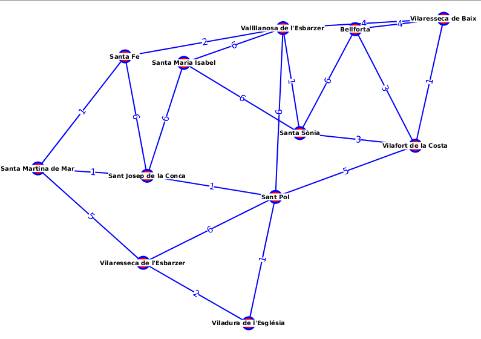
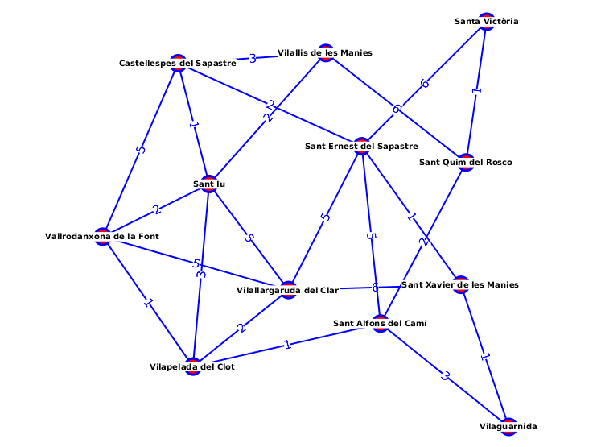

# generadorDeCarreteres
El programa es fa servir per generar diferents resultats sobre les carreteres 
de l'exercici del mòdul 6 de programació de DAW. Que va sobre l'accés a base de dades 

[Exercici](https://uf.ctrl-alt-d.net/material/mostra/453/rectilandia-el-29e-estat-de-la-unio-europea)

El programa fa servir la llibreria de generació aleatòria de Pobles per generar dinàmicament diferents pobles
i rutes entre els pobles.

Per ara cal canviar les constants del programa `App.java` per poder canviar-ne les opcions (però algun dia
ho canviaré, o no)

    // Número de pobles que s'han de generar
    private static final int NUMERODEPOBLES = 12;

    // Número mínim de veins que tindrà cada poble
    private static final int MINVEINS = 2;
    // Número màxim de veins
    private static final int MAXVEINS = 4;

    // Per quan sembla que no té més possibles opcions de veins
    private static final int MAXINTENTS = 10;

    // Número màxim de Km entre ciutats
    private static final int MAXKM = 6;

    private static final boolean SAVEDATABASE = false;

## Què fa el programa

### Mostra el graf generat

El programa treu una pantalla gràfica amb els pobles i camins aleatòris generats en forma de graf

Notes: 
* L'aspecte es pot personalitzar canviant el CSS
* En les carreteres s'hi ha afegit el pes d'anar d'un poble a un altre per poder fer el programa més complexe.

### Desa les dades en una base de dades Postgresql

En cas de canviar la constant `SAVEDATABASE` a `true` el generat es guardarà en una base de dades Postgresql anomenada `ciutats`

## TODO 

* Entrada de dades des de la 
* Permetre personalitzar la base de dades generada i canviar el SGDB
* ...
